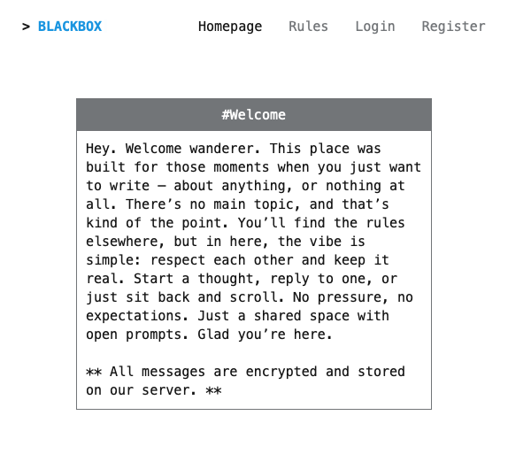
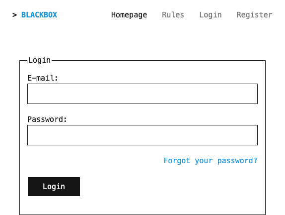
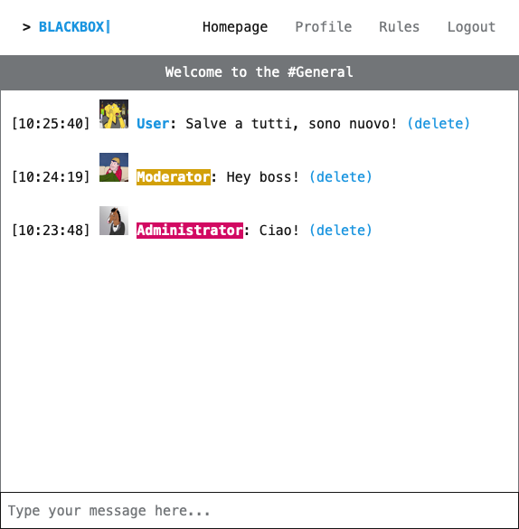
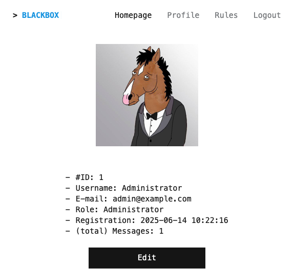
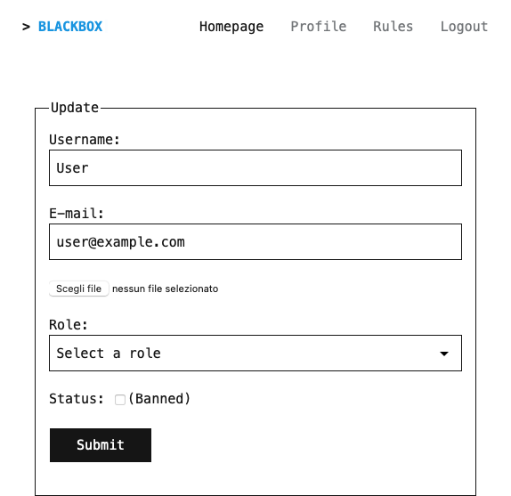

# Blackbox

Blackbox is a terminal-style chatroom application built with Laravel. It offers real-time encrypted messaging in a minimalist retro interface using [terminal.css](https://terminalcss.xyz/).

The platform supports real-time communication, user roles (Administrator, Moderator, User), and strong account control features in a vintage-styled environment.

---

<p align="center">
  
  
  
</p>

<p align="center">
  
  
</p>

---

## Features

### 🔐 Authentication & User Access
- Laravel Fortify-based secure authentication.
- Users can register and immediately access the chatroom.
- Password modification and email change with re-verification.
- All users have access to view other users' profiles.

### ⚡ Real-Time Encrypted Chat
- Built using Laravel Livewire for dynamic communication.
- Messages are end-to-end encrypted.
- Terminal-inspired minimalist UI for retro aesthetics.
- Community guidelines page (Rules section).

### 👤 User Profile
- Custom profile picture.
- Role badge (User / Moderator / Administrator).
- Total messages sent.
- Registration date displayed.

---

## Moderator Tools

🛡️ **Moderators can:**
- Delete any user's messages.
- Modify any user's:
  - Username
  - Profile picture
- Ban users.

👑 **Administrators can:**
- Perform all moderator actions.
- Full control over the platform and user management.

🙋‍♂️ **Standard Users can:**
- Edit their own profile (username, profile image, email, password).
- Email changes require re-verification.

🎖️ **Role Badges:**
- Admins and moderators have visible role badges in the chatroom.

---

## 🛠 Tech Stack

- PHP
- Laravel
- Laravel Fortify / BanHammer
- Laravel Livewire
- MySQL
- terminal.css

---

## ⚡ Installation & Local Setup

Follow these steps to clone and run the project locally:

```bash
# Clone the repository
git clone https://github.com/Alorythm/blackbox-chatroom.git
cd blackbox-chatroom

# Install dependencies
composer install
npm install

# Setup environment configuration
cp .env.example .env
php artisan key:generate

# Configure database and mail settings in .env
# (Edit the following lines inside the .env file)
# DB_DATABASE=your_db
# DB_USERNAME=your_user
# DB_PASSWORD=your_password
# MAIL_...

# Run database migrations with optional seeding
php artisan migrate --seed

# Start local development server
php artisan serve

# In a separate terminal, compile assets with Vite
npm run dev